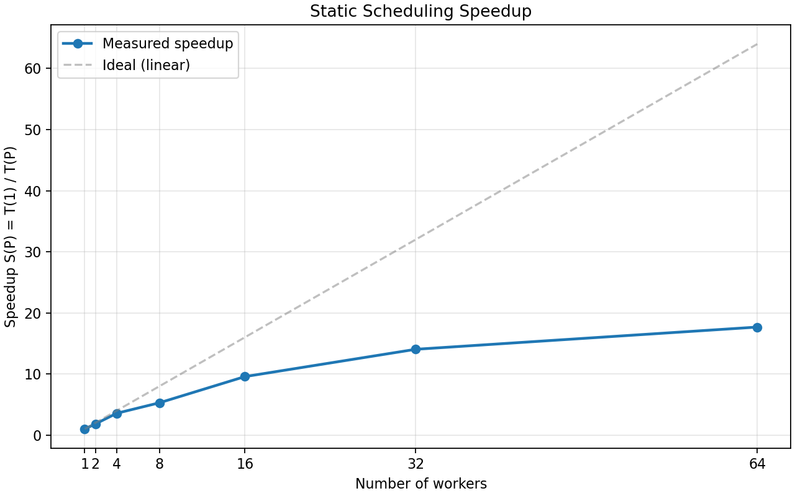

# Task 5: Static Scheduling -- Answers

## 5a) Speedup Plot

| Workers | Time (s)   | Speedup |
|---------|------------|---------|
| 1       | 763.63     | 1.00    |
| 2       | 419.01     | 1.82    |
| 4       | 213.95     | 3.57    |
| 8       | 144.47     | 5.29    |
| 16      | 79.81      | 9.57    |
| 32      | 54.40      | 14.04   |
| 64      | 43.20      | 17.68   |

The speedup is sub-linear — it grows with more workers but falls increasingly short of the ideal (linear) speedup line. This is expected due to the serial fraction of the computation (process startup, I/O, synchronization overhead) and load imbalance across floorplans with different convergence times.

## 5b) Parallel Fraction (Amdahl's Law)

**Amdahl's law**
$$S(P) = 1 / ((1 - f) + f/P)$$

Rearranging to estimate f from measured speedup S at P workers:

$$f = (1 - 1/S) / (1 - 1/P)$$

Using the measurement at P = 64 workers, S = 17.68:

f = (1 - 1/17.68) / (1 - 1/64) = 0.9434 / 0.9844 = 0.9584

Approximately **95.8%** of the computation is parallelizable.

## 5c) Theoretical Maximum Speedup

$$S_{max} = 1 / (1 - f) = 1 / (1 - 0.9584) = 24.04$$

Achieved speedup: 17.68x at P = 64 workers.
This is **73.5%** of the theoretical maximum.

Diminishing returns become visible beyond P = 16 workers. Going from 32 to 64 workers only improves speedup from 14.04x to 17.68x (a 1.26x gain for doubling workers), indicating that the serial overhead and load imbalance dominate at higher worker counts.

## 5d) Estimate for All Floorplans

Using the fastest configuration (P = 64):

- Time for 100 floorplans: 43.20 s
- Per-floorplan time: 0.432 s
- Total floorplans available: 4571
- Estimated time for all floorplans: 1974.7 s (~32.9 min)
