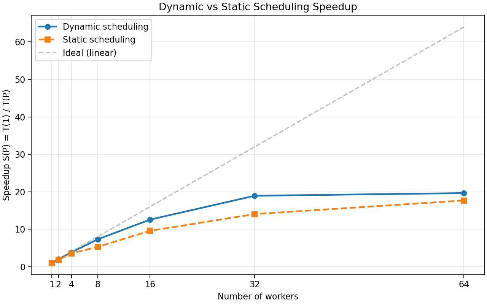

# Task 6: Dynamic Scheduling -- Answers

## 6a) Did it get faster? By how much?

| Workers | Static (s) | Dynamic (s) | Difference       |
|---------|------------|-------------|------------------|
| 1       | 763.63     | 734.73      | baseline         |
| 2       | 419.01     | 367.17      | 51.84 s faster   |
| 4       | 213.95     | 191.69      | 22.27 s faster   |
| 8       | 144.47     | 100.62      | 43.85 s faster   |
| 16      | 79.81      | 58.50       | 21.31 s faster   |
| 32      | 54.40      | 38.82       | 15.58 s faster   |
| 64      | 43.20      | 37.40       | 5.80 s faster    |

**Yes, dynamic scheduling is consistently faster** across all worker counts. The improvement is most pronounced at P=8 (43.85 s faster, a 30% reduction) and remains significant throughout. Even at P=1, dynamic is slightly faster (734.73 s vs 763.63 s) — this is likely due to run-to-run variance since both use sequential execution at P=1.

The key reason dynamic scheduling wins is **load balancing**: different floorplans require different numbers of Jacobi iterations to converge. With static scheduling (`chunksize = ceil(N/P)`), each worker gets a fixed block of floorplans — if one block happens to contain slower-converging floorplans, that worker becomes a bottleneck while others sit idle. With dynamic scheduling (`chunksize=1`), a worker that finishes a fast floorplan immediately picks up the next one, keeping all workers busy.

## 6b) Did the speed-up improve or worsen?

| Workers | Static Speedup | Dynamic Speedup |
|---------|----------------|-----------------|
| 1       | 1.00           | 1.00            |
| 2       | 1.82           | 2.00            |
| 4       | 3.57           | 3.83            |
| 8       | 5.29           | 7.30            |
| 16      | 9.57           | 12.56           |
| 32      | 14.04          | 18.93           |
| 64      | 17.68          | 19.65           |

**The speedup improved with dynamic scheduling**, and the gap widens as the number of workers increases. At P=32, dynamic achieves 18.93x speedup compared to static's 14.04x — a substantial improvement. At P=64, dynamic reaches 19.65x vs static's 17.68x.

Dynamic scheduling handles load imbalance from varying convergence times much better: workers that finish a fast floorplan immediately pick up the next one, rather than waiting idle while another worker processes a slow floorplan. This effect becomes more important at higher worker counts where load imbalance is the dominant source of inefficiency — with many workers, even a single slow floorplan in a static block can leave many workers idle.

Note that dynamic scheduling's gains flatten between P=32 (18.93x) and P=64 (19.65x), suggesting that at 64 workers the remaining serial overhead (process management, I/O) rather than load imbalance becomes the bottleneck.
