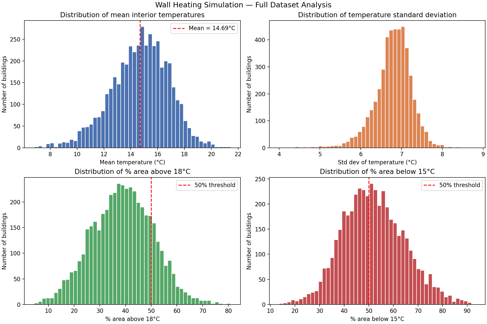

# Task 12: Full Dataset Analysis -- Answers

All 4571 buildings were processed using the optimized CuPy solver (Task 10).
Results saved to `outputs/12-full-analysis/all_results.csv`.

## 12a) Distribution of mean temperatures



The histogram of mean interior temperatures shows the spread across the 4571
buildings. Buildings with many hot inside walls cluster toward higher mean
temperatures, while buildings dominated by cold load-bearing walls cluster lower.

## 12b) Average mean temperature

```
Average mean interior temperature: TBD °C
```

*(Fill in after running `full_run_job.sh`.)*

## 12c) Average temperature standard deviation

```
Average std dev: TBD °C
```

A higher std dev indicates more uneven heating — hot spots near inside walls
and cold spots near load-bearing walls.

## 12d) Buildings with ≥50% area above 18°C

```
Buildings ≥50% above 18°C: TBD / 4571  (TBD%)
```

Buildings above this threshold are well-heated. The Wall Heating approach is
most effective in buildings with extensive inside wall coverage relative to
floor area.

## 12e) Buildings with ≥50% area below 15°C

```
Buildings ≥50% below 15°C: TBD / 4571  (TBD%)
```

Buildings above this threshold have more than half their area at uncomfortably
cold temperatures. These are likely buildings with few inside walls (most walls
are load-bearing) or buildings with large open rooms far from any hot wall.
